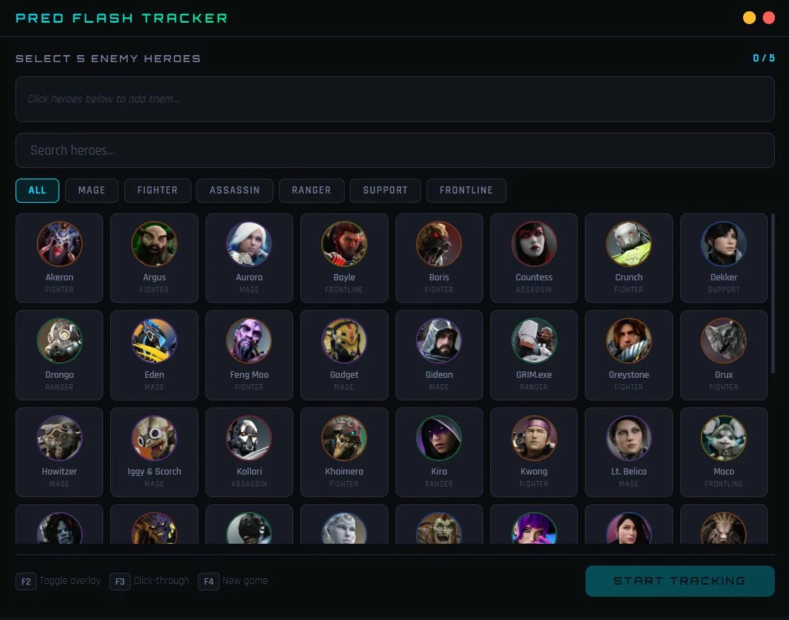
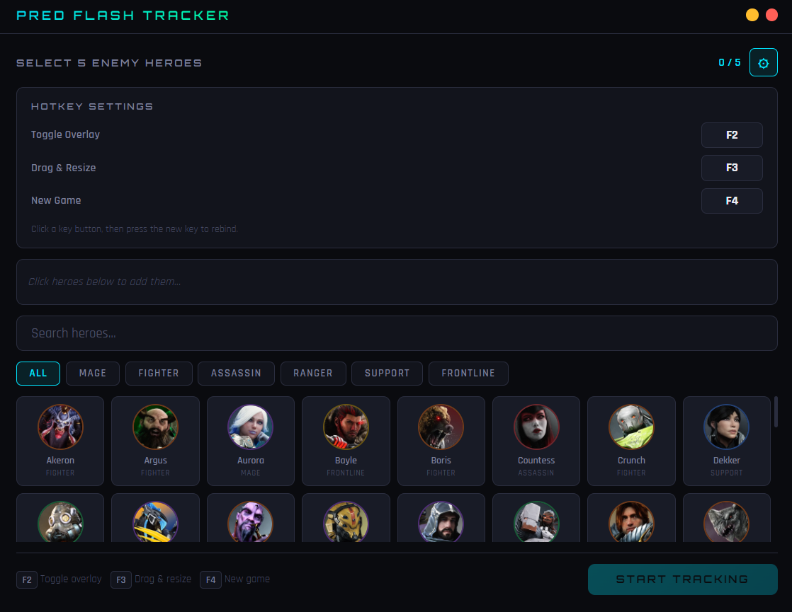
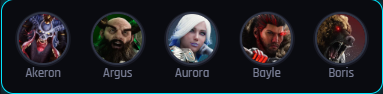

# Pred Flash Tracker

A lightweight desktop overlay for **Predecessor** that tracks enemy flash (blink) cooldowns in real time. Click a hero portrait to start a 5-minute timer — no API integration, no game injection, just a simple transparent window on top of your game.


## Screenshots

### Hero Select


### Settings


### In-Game Overlay


## Features

- Full Predecessor hero roster with official portraits
- Click a hero portrait to start a **5-minute flash cooldown timer** — no need to unlock the overlay first
- Visual ring timer with color-coded states (red = on cooldown, yellow = almost ready, green flash when ready)
- Right-click a hero to cancel a timer
- Drag and resize the overlay to fit your setup (press F3)
- Automatically flips from horizontal to vertical layout when resized narrow
- Portraits go grayscale when on cooldown, restoring to full color when flash is back up

## Easy Anti-Cheat Safe

This app is safe to use alongside Easy Anti-Cheat. It does **not** inject into the game process, read memory, or hook into any rendering pipeline. It's a normal desktop window sitting on top of your game — the same approach used by Discord, OBS, and Medal.tv.

## Quick Start

### Prerequisites

- [Node.js](https://nodejs.org/) v18 or newer

### Install & Run

```bash
git clone https://github.com/AndrewTalley/pred-flash-tracker.git
cd pred-flash-tracker

npm install

# Download hero portrait images (one-time)
node scripts/download-portraits.js

npm start
```

The portrait script fetches all hero images from statz.gg and saves them locally. If any fail to download, the app shows initials as a fallback.

## How to Use

1. Launch the app — the hero select screen appears
2. Search or filter by role, then select 5 enemy heroes
3. Click **Start Tracking** — the overlay appears at the top-center of your screen
4. Open Predecessor in **Fullscreen Borderless** mode
5. When an enemy burns flash, hover over their portrait in the overlay and click — a 5-minute countdown starts
6. The ring animates and the portrait goes grayscale. At 30 seconds remaining it turns yellow and pulses. When flash is back up, the portrait flashes green
7. Right-click a hero to cancel a timer if you misclicked

## Hotkeys

| Key | Action |
|-----|--------|
| **F2** | Show / hide the overlay |
| **F3** | Toggle drag & resize mode (reposition or resize the overlay) |
| **F4** | New game — close overlay and go back to hero select |

You do **not** need to press any hotkey to click hero portraits. The overlay detects when your mouse is over a hero and becomes clickable automatically.

## Building for Distribution

To create a standalone installer that anyone can download and run without Node.js:

```bash
npm run build:win     # Windows .exe installer
npm run build:mac     # macOS .dmg
npm run build:linux   # Linux .AppImage
```

Output goes to the `dist/` folder. On Windows, you may need to enable **Developer Mode** in Settings or run as administrator the first time you build.

## Project Structure

```
pred-flash-tracker/
├── package.json
├── scripts/
│   └── download-portraits.js
├── src/
│   ├── main.js              # Electron main process
│   ├── heroes-data.js       # Hero roster (names, roles, images)
│   ├── assets/heroes/       # Downloaded portrait images
│   └── renderer/
│       ├── setup.html       # Hero selection screen
│       └── overlay.html     # In-game overlay
├── screenshots/             # README images
└── build/                   # App icons for packaging
```

## Customization

**Flash cooldown duration** — in `src/renderer/overlay.html`, change:
```javascript
const FLASH_COOLDOWN = 300; // seconds (5 minutes)
```

**Hotkeys** — in `src/main.js`, modify the `globalShortcut.register` calls.

**Starting position** — in `src/main.js`, change the `x` and `y` values in `createOverlayWindow()`.

## License

MIT — use it, modify it, share it. Happy hunting on Omeda!
